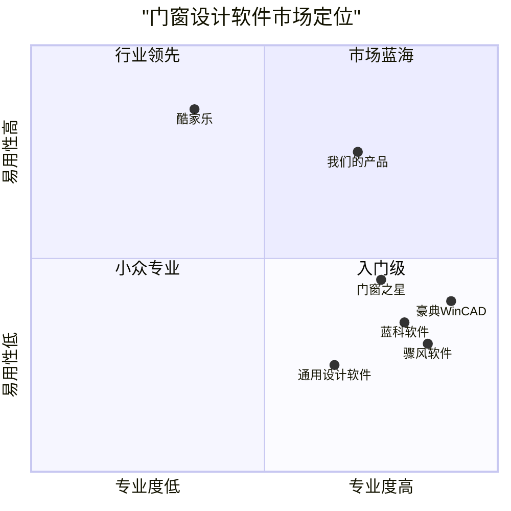

# 门窗绘制软件产品需求文档 (PRD)

## 项目概述

### 项目名称
door_window_designer

### 需求概述
开发一款基于Web的门窗绘制类软件，帮助用户进行门窗设计、编辑和保存等操作。该软件旨在提高门窗设计效率，优化用户体验，满足专业人士和普通用户的门窗设计需求。

### 原始需求
用户想要一个门窗绘制类软件，能够在Web环境中运行，支持门窗的设计、编辑和保存等功能。

## 产品定义

### 产品目标
1. **提升设计效率**：通过直观的用户界面和丰富的模板库，让用户能够快速完成门窗设计
2. **增强可视化体验**：提供实时预览和多角度查看功能，帮助用户更好地理解设计效果
3. **优化协作流程**：支持团队协作和设计方案共享，提高项目协作效率

### 用户故事
1. 作为一名室内设计师，我希望能够快速绘制各种类型的门窗设计，以便在客户沟通中展示多种方案选择
2. 作为一名门窗销售人员，我希望能够实时调整门窗参数并生成报价单，以便为客户提供精确的报价和可视化的产品展示
3. 作为一名装修业主，我希望能够通过简单的操作设计自己的门窗方案，以便更好地与装修公司沟通我的需求
4. 作为门窗生产厂家的技术人员，我希望能够获取精确的设计数据和下料清单，以便进行生产制造
5. 作为项目经理，我希望能够管理和查看团队成员创建的所有门窗设计方案，以便更好地协调项目进展

### 竞品分析

| 产品名称 | 优势 | 劣势 |
|---------|------|------|
| 酷家乐 | 操作简单、学习成本低、丰富模型库、全链路设计、大量户型图库 | 专业门窗设计功能相对有限，更侧重于整体家装设计 |
| 豪典门窗设计系统WinCAD | 专业CAD平台、矢量图形组织、灵活绘图、精确下料计算 | 学习曲线较陡、非Web应用、跨平台兼容性差 |
| 骤风软件门窗优化下料软件 | 多种报价方式、成本分析全面、内置大量窗型、套料优化强大 | 界面过于复杂、非Web应用、移动端支持有限 |
| 蓝科门窗设计下料优化软件 | 支持AutoCAD输出、完善仓库管理、材料优化 | 可视化效果不足、用户体验一般、缺乏协作功能 |
| 门窗之星设计软件 | 数据统计分析能力强、支持多种输出格式、性价比高 | 界面设计落后、功能过于专业化、上手难度大 |
| 3DMAX/SketchUp等通用设计软件 | 功能强大、自由度高、渲染效果好 | 不专注于门窗设计、学习成本极高、缺乏行业专用功能 |

### 竞品象限图


## 技术规格

### 需求分析

门窗绘制软件作为连接设计与制造的桥梁，需要满足用户对精确设计、直观展示、成本控制、协同工作等多方面需求。随着市场的发展，门窗设计呈现出个性化、节能化、智能化的趋势，这也对软件提出了新的要求。基于市场需求和技术可行性分析，我们的门窗绘制软件将采用Web应用形式，以React框架和Tailwind CSS为基础技术栈，满足跨平台使用需求。

### 需求池

#### P0: 必须实现功能（Must Have）

1. **基础绘图功能**
   - 支持常见门窗类型的创建和编辑（平开门、推拉门、平开窗、推拉窗等）
   - 提供基本绘图工具（线条、矩形、圆形等）
   - 支持尺寸标注和修改

2. **参数化设计**
   - 门窗尺寸、材质、颜色等参数的定制化设置
   - 支持开启方式、玻璃类型等功能性选项调整
   - 提供常用门窗比例和尺寸的预设选项

3. **2D/3D预览功能**
   - 实时2D设计视图
   - 3D模型预览功能
   - 多角度查看设计效果

4. **项目保存与导出**
   - 设计方案的保存和加载
   - 支持常用格式导出（如PDF、PNG、JPG）
   - 设计数据的备份和恢复

5. **用户账户系统**
   - 用户注册和登录功能
   - 个人设计方案管理
   - 基本的权限控制

#### P1: 应该实现功能（Should Have）

1. **模板库**
   - 提供门窗设计模板
   - 支持自定义模板创建和保存
   - 模板分类和搜索功能

2. **材料清单与报价**
   - 自动生成材料清单
   - 基于当前设计的成本估算
   - 可定制的报价单生成

3. **协作功能**
   - 设计方案共享
   - 多用户同时查看功能
   - 评论和反馈系统

4. **渲染效果优化**
   - 材质纹理真实显示
   - 光照效果模拟
   - 环境场景融入

5. **移动端支持**
   - 响应式设计适配移动设备
   - 触屏操作优化
   - 基本的移动端功能

#### P2: 可以实现功能（Could Have）

1. **高级可视化功能**
   - VR/AR预览支持
   - 高质量渲染输出
   - 动画展示（如门窗开关动画）

2. **BIM/CAD集成**
   - 支持CAD图纸导入
   - BIM模型关联
   - 与其他设计软件的数据互通

3. **智能辅助功能**
   - 智能尺寸推荐
   - 设计规范检查
   - 基于AI的设计优化建议

4. **团队协作增强**
   - 实时协作编辑
   - 版本控制与历史记录
   - 团队工作流管理

5. **数据分析和报表**
   - 设计统计数据
   - 材料使用报告
   - 项目进度追踪

### UI设计草图

#### 主界面布局
```
+---------------------------------------------------------------+
|  Logo  | 文件 | 编辑 | 视图 | 工具 | 帮助           用户信息   |
+---------------------------------------------------------------+
|       |                                           |             |
|       |                                           |             |
|工具栏  |              设计区域                      |  属性面板   |
|       |                                           |             |
|       |                                           |             |
|       |                                           |             |
+---------------------------------------------------------------+
|  模板库 | 材质库 | 状态栏信息                      保存 | 预览  |
+---------------------------------------------------------------+
```

#### 功能区域说明

1. **顶部菜单栏**：提供文件操作、编辑功能、视图切换、工具选择和帮助信息

2. **左侧工具栏**：包含绘图工具、选择工具、尺寸标注工具等

3. **中央设计区域**：主要的门窗设计工作区，支持直接绘制和编辑

4. **右侧属性面板**：显示并允许编辑当前选中对象的属性（尺寸、材质、颜色等）

5. **底部状态栏**：显示当前操作状态、坐标信息、比例等

6. **功能按钮区**：包含保存、预览、导出等快捷功能按钮

7. **资源库标签页**：可切换查看模板库、材质库、组件库等资源

### 开放问题

1. **技术架构选择**：是否需要考虑使用WebGL以提供更好的3D渲染效果？是否需要集成专业CAD引擎？

2. **数据安全问题**：如何确保用户设计数据的安全性和隐私保护？

3. **扩展性考虑**：如何设计系统架构以便未来能够轻松添加新功能和集成第三方服务？

4. **性能优化**：如何优化大型复杂设计的渲染和操作性能？

5. **市场定位**：产品应更侧重于专业用户还是普通消费者？如何平衡专业性与易用性？

6. **商业模式**：采用订阅制、一次性购买还是免费增值模式？

7. **本地化需求**：如何满足不同地区对门窗设计标准的差异化需求？

## 实施计划

### 开发阶段

1. **原型设计**（4周）
   - 用户界面设计
   - 交互流程设计
   - 用户测试与反馈

2. **核心功能开发**（12周）
   - 基础绘图功能实现
   - 参数化设计系统构建
   - 2D/3D预览功能开发
   - 用户账户系统实现

3. **增强功能开发**（8周）
   - 模板库系统
   - 材料清单与报价功能
   - 协作功能
   - 渲染效果优化

4. **测试与优化**（4周）
   - 功能测试
   - 性能优化
   - 用户体验优化

5. **发布与推广**（持续）
   - 产品发布
   - 市场推广
   - 用户反馈收集与迭代改进

### 技术栈选择

- **前端框架**：React.js
- **UI设计**：Tailwind CSS
- **3D渲染**：Three.js
- **后端**：Node.js
- **数据库**：MongoDB
- **云存储**：AWS S3或阿里云OSS
- **版本控制**：Git

## 成功指标

### 短期指标（6个月）

- 注册用户数达到10,000+
- 每月活跃用户达到2,000+
- 用户满意度评分达到4.0/5.0以上
- 完成设计方案数量达到50,000+

### 长期指标（2年）

- 注册用户数达到100,000+
- 每月活跃用户达到20,000+
- 用户满意度评分达到4.5/5.0以上
- 成为门窗行业设计软件市场前三名品牌
- 实现正向现金流和可持续盈利模式

## 风险评估

### 技术风险

- 3D渲染性能在低配置设备上可能不佳
- 不同浏览器兼容性问题
- 大型项目的数据处理和存储挑战

### 市场风险

- 已有竞品的市场占有率高
- 用户对Web应用专业性的质疑
- 门窗行业数字化转型进度不一

### 缓解策略

- 实施渐进增强的开发策略，确保基本功能在各种设备上可用
- 与行业专家合作开发专业功能，提升产品可信度
- 提供免费基础版本，降低用户采用门槛
- 开发详细的教程和培训资料，降低学习成本